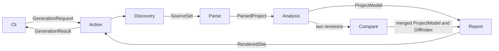

# Generation pipeline

DocGen is a CLI program that turns a selected set of PHP sources into a documentation site. Its layers follow that work. The directories under `src/DocGen` and the layers in `deptrac.yaml` use the same names.

`Cli` validates arguments, applies the process memory limit, prints the outcome, and optionally starts the preview server. It submits a `GenerationRequest` to `Action` and receives a `GenerationResult`: page and package counts, warnings, output location, cache summary, and comparison labels. Analysis objects and cache instances do not cross back into the CLI.

`Action/GenerateDocumentation` owns the run. `Action/ProjectAnalysis` connects the first three stages in order; a diff run executes them once for each revision before comparing and reporting. Git checkout creation and cleanup belong to `Action/Revision`, so worktrees remain available until reporting finishes.

These arrows show execution and data flow. PHP dependencies point toward the stage that owns a consumed result. Action explicitly invokes the stages; a later stage does not invoke an earlier stage to reconstruct its input.

| Stage | Work completed at the boundary | Result |
| --- | --- | --- |
| Discovery | Resolve package selections, autoload directories, exclusions, source identities, Markdown documents, and selection warnings. | `SourceSet`, containing concrete `SourceFile` entries with package name, relative path, and dev status. |
| Parse | Read the selected files, extract declarations, PHPDoc and references, and merge worker results in discovery order. | `ParsedProject`, containing declarations, references and parse warnings. It contains no AST or parser instance. |
| Analysis | Build symbol lookup, inheritance, usage and test indexes; connect packages; attach coverage and dependency-layer assignments. | `ProjectModel`, the completed project documentation facts. |
| Compare | Compare two completed project results and include removed declarations in the displayed result. | A merged `ProjectModel` and the element statuses in `DiffIndex`. |
| Report | Choose pages, generate HTML and assets, write files, and record output cache results. | `RenderedSite`, containing the page count and output warnings. |

The whole run's `DocGenConfig` stays in Action. Discovery receives a `SourceSelection` with only package and file selection. Parse receives completed discovery results rather than selection patterns. Analysis receives those results, a `ParsedProject`, and `AnalysisOptions` with project metadata and auxiliary report locations. It does not discover files, parse PHP, open Git worktrees, or render pages.

## Result ownership and dependencies

Values live with the stage that produces them. Package descriptions belong to Discovery, extracted declarations and reference occurrences to Parse, project indexes to Analysis, and comparison statuses to Compare. Later results retain these facts where their meaning stays the same. The enclosing result changes when a stage completes new work; the project does not collect all values into a shared Model layer.

Report reads a completed `ProjectModel` and an optional `DiffIndex`, including their contained package descriptions and declarations. This explains its dependencies on the earlier result types. It neither receives the run configuration nor manages parsing or revision lifetimes.

Worker implementations live in each stage's `Internal` directory. Deptrac's private collectors keep these classes inside that stage even when another layer can consume its results. Examples include manifest readers in Discovery, AST visitors and declaration builders in Parse, relation builders in Analysis, and declaration mergers in Compare. Public stage entry points and result values remain outside `Internal`.

The rules prohibit dependencies from Discovery to Parse, from Parse to Analysis, from Analysis to Compare or Report, and from all processing stages back to Action or Cli. Cli can depend only on Action. For example, a declaration cannot acquire a dependency on Git checkout management, and a reporting class cannot use an internal declaration builder or merger.

Cache and Parallel are small supporting components used by the processing stages. Neither knows the pipeline. Source cache interpretation belongs to Parse, page cache interpretation belongs to Report, and Action manages their run lifetime. `DocGenException` is the single package-wide error contract at the package root; it intentionally has no processing layer.

## Validation

Run `composer lint` and `composer test:unit` in this package. Lint includes Deptrac, PHPStan, PHP compatibility, formatting, autoload, and Guard checks. Stage tests cover discovery independently of syntax validity, relation analysis from already extracted data, stable parsing results, generation and comparison, and cache reuse. `deptrac debug:unassigned` should list only `Toolkit\DocGen\DocGenException`.
